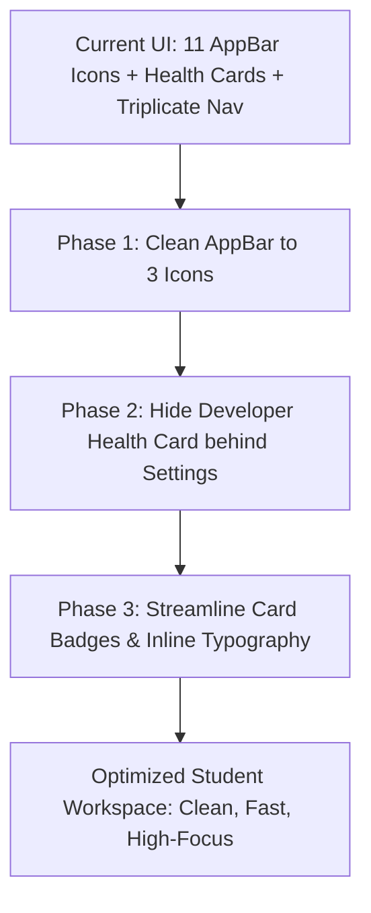

# Student OS — UI/UX Audit & Unnecessary Elements Review (`unnecessary_ui.md`)

This document provides an in-depth design audit of the **Student OS** Flutter frontend. It categorizes visual clutter, redundant controls, duplicate navigation pathways, and developer-only widgets that can be removed or consolidated to create a clean, distraction-free student workspace.

---

## 1. Executive Summary & Core Observations

| Category | Finding | Impact | Recommended Action |
| :--- | :--- | :--- | :--- |
| **Top AppBar Overcrowding** | 11 action icons squeezed horizontally into the `DashboardScreen` AppBar | Severe horizontal clutter on mobile screens (<400px width) | Reduce to 3 essential icons (AI Assistant, Notifications, Profile Avatar) |
| **Triplicate Navigation** | Feature links repeated in AppBar + Quick Actions + Profile PopupMenu | Cognitive overload and redundant tap targets | Standardize on clean Quick Actions + Bottom Navigation / Drawer |
| **Developer Health Card** | Live FastAPI & MongoDB status card displayed at the bottom of the student dashboard | Non-essential infrastructure telemetry shown to end-users | Move to a dedicated **Settings / Diagnostics** screen |
| **Duplicate Creation Buttons** | "Add Task", "Add Exam", "Add Subject" repeated across Quick Actions and each empty state card | Repetitive UI blocks on empty accounts | Unify creation triggers into a single contextual Floating Action Button (FAB) or Quick Actions bar |
| **Over-badged Cards** | 4–6 colored pills per card (Type, Subject, Priority, Weight, Countdown, Grade) | Visual noise and high card density | Consolidate metadata into subtle inline typography |

---

## 2. Screen-by-Screen Clutter Breakdown

### 2.1 Dashboard Screen (`dashboard_screen.dart`)

```
Current Dashboard AppBar Layout (Overcrowded):
[ 🎓 Student OS ]  [ ✨ ] [ 🔔 ] [ 📊 ] [ 📅 ] [ 📝 ] [ ✅ ] [ ☁️ ] [ 📒 ] [ 📚 ] [ 🔄 ] [ 👤 ]
                      └─────── 11 Action Icons on Mobile! ───────┘
```

#### A. Overcrowded AppBar Actions (Lines 74–140)
- **Current State**: Contains 11 separate icon buttons: AI Assistant, Notifications, GPA & Analytics, Timetable, Exams, Planner, Cloud Drive, Notes, Subjects, Refresh Status, and Profile Avatar.
- **Why It's Unnecessary**: On standard mobile devices (360–390px wide), 11 buttons take >480px, overflowing the app bar and pushing critical buttons off-screen.
- **Recommendation**:
  - Keep only:
    1. `AutoAwesome` (AI Study Assistant)
    2. `NotificationBadgeButton` (Notifications with unread count)
    3. `CircleAvatar` (Profile PopupMenu)
  - Remove direct feature icons from the top bar since they already exist in the **Quick Actions** section and **Profile Menu**.

#### B. Triplicate Navigation Redundancy
- **Current State**: A student can navigate to "Exams & Calendar" from:
  1. The top AppBar icon.
  2. The "Add Exam" / Quick Actions wrap.
  3. The Profile dropdown menu.
  4. The "View All Exams" header button in the section below.
- **Recommendation**: Retain the section header link (`Upcoming Exams -> View All`) and the Quick Action chip. Remove the redundant AppBar and Profile menu duplicates.

#### C. Backend & Database Health Status Card (Lines 882–928)
- **Current State**: Displays a card at the bottom with:
  - `FastAPI REST Server: Operational`
  - `MongoDB Database: Connected`
- **Why It's Unnecessary**: Real students using the app for studying do not need to monitor server socket health or database connection strings.
- **Recommendation**: Move backend synchronization diagnostics to a **Settings > Diagnostics** tab, or show an alert banner only when the app is offline.

---

### 2.2 Today's Classes & Timetable Cards (`today_schedule_card.dart`)

#### A. Duplicate Time Display
- **Current State**:
  - Live Status Pill: `"Starts in 15 mins"`
  - Time Range: `"10:00 AM - 11:20 AM"`
  - Duration badge: `"80 mins"`
- **Recommendation**: Combine into a single readable string: `"10:00 – 11:20 AM (in 15 mins)"`.

#### B. Four Simultaneous Attendance Buttons in Empty States
- **Current State**: Displays `Present`, `Late`, `Absent`, `Excused` pills on every class card simultaneously.
- **Recommendation**: On compact cards, show a single **"Mark Attendance"** button that opens a bottom sheet or dropdown, saving ~60px vertical height per card.

---

### 2.3 Assignment & Planner Cards (`assignment_card.dart`)

#### A. Weight Percentage Pill in Card Header (Line 134)
- **Current State**: Shows `'25% weight'` as a separate background pill in addition to Priority, Subject, Status Icon, Due Date, and Countdown text.
- **Recommendation**: Inline the weight next to the due date (`Due Sep 18 • 25% of Grade`) instead of creating an extra boxed pill.

#### B. Status Circle vs. Menu "Set as Status"
- **Current State**: The card has a 1-tap toggle circle on the left AND 4 separate status items inside the 3-dot popup menu (`Set as To-Do`, `Set as In Progress`, `Set as Submitted`, `Set as Graded`).
- **Recommendation**: Retain the 1-tap circle toggle. In the 3-dot menu, keep only `Edit` and `Delete`.

---

### 2.4 Exam Schedule Cards (`exam_card.dart`)

#### A. Redundant Target vs. Actual Grade Badges (Lines 330–374)
- **Current State**: When an exam is upcoming, it shows `Target: 85.0%`. When completed, it shows both `Target: 85.0%` and `Score: 92.0%`.
- **Recommendation**: Only display the final `Score: 92.0%` once the exam has concluded. Show target grade only in the detail dialog.

---

### 2.5 Auth & Login Screens (`login_screen.dart` & `register_screen.dart`)

#### A. Sample Autofill Button in Production
- **Current State**: "Autofill Sample Student" (`alex.rivera@stanford.edu`) button directly under the Sign In button.
- **Recommendation**: Conditionally render this button only when `kDebugMode == true` or `ENVIRONMENT == 'development'`.

---

## 3. UI Simplification Roadmap



### Action Items for Future UI Refinement:
1. **AppBar Pruning**: Keep `[AI Assistant]`, `[Notifications Badge]`, and `[User Avatar]` in the top bar.
2. **Remove Infrastructure Telemetry**: Move the `Backend & Database Health Card` from the student dashboard into a dedicated dev/settings drawer.
3. **Streamline Quick Actions**: Limit dashboard quick actions to the top 4 student actions:
   - `✨ Ask AI`
   - `📝 New Note`
   - `➕ Add Task`
   - `📅 Schedule Class/Exam`
4. **Debug Button Condensation**: Hide `"Autofill Sample Student"` in release builds (`kDebugMode`).
